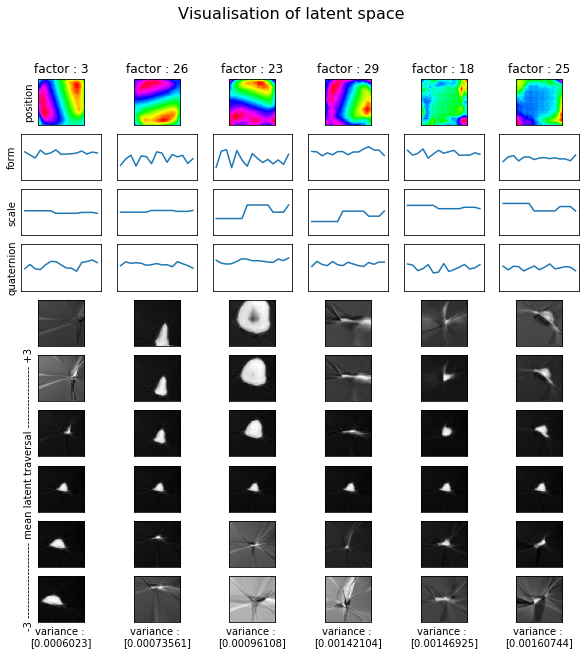
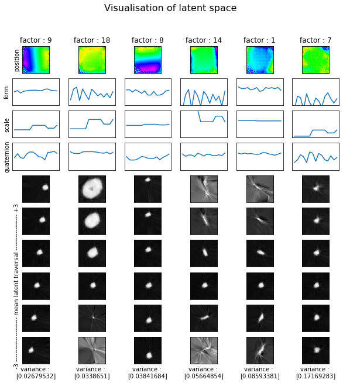
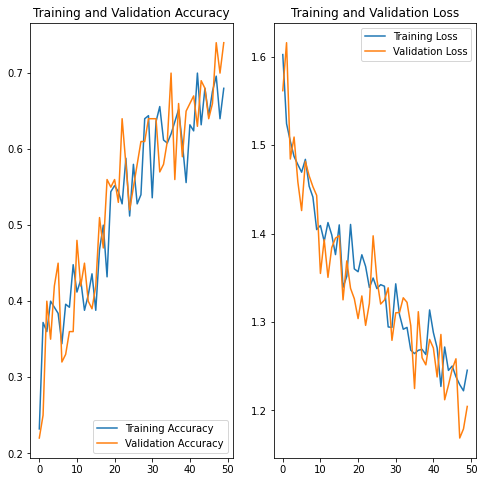
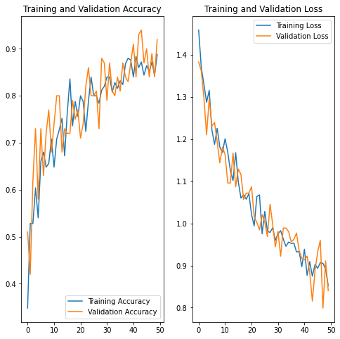

# beta-vae

Le projet suivant consiste en l'implémentation d'un "spatial broadcast beta-VAE" ainsi que de différentes fonctions
permettant de caractériser le démélage de l'espace latent du modèle, en fonction de la variation de beta. Ce dossier contient
l'ensemble des classes nécessaires à l'architecture : soient une classes dataset.py permettant de générer des images, une classe
variationAutoEncoder.py contenant l'implémentation de l'encodeur et du décodeur, une classe training pour l'entraînement ainsi qu'une classe latentSpace.py implémentant l'ensemble des fonctions permettant la qualification de l'espace latent. La classe data.py est une classe supplémentaire utilisant uniquement des objets Tensorflow Dataset, sans besoin de générer de translations ou de zoom en temps réel. Elle n'est pas nécessaire au bon fonctionnement du projet.
Finalement, pour un aperçu visuel, les notebook "vae_viz.ipynb" et "latent_space.ipynb" permettent de visualiser l'entraînement du réseau ainsi que l'espace latent du modèle entraîné. 

# Installation

Requis: Python 3.7+ | Linux, Mac OS X, Windows

```sh
pip install virtualenv
```
Puis dans le dossier du projet:  

```sh
source venv/bin/activate
```
Lancer cette commande activera l'environnement virtuel, dans lequel l'ensemble des paquets nécessaires au projet sont placés. 
Si le venv n'est pas téléchargé (fichier trop volumineux), alors lancer la commande suivante : 

```sh
pip install -r requirements.txt
```

Cela permet d'installer les paquets et les librairies dans les versions nécessaires. 

# Préparez-vous :

Pour lancer le notebook principal se lance:
```sh
jupyter notebook
```
Puis sélectionner vae_viz.ipynp pour l'entraînement
ou latent_space.ipynb pour la visualisation de l'espace latent.

# Description

Ce dossier contient l'ensemble des fichiers nécessaires pour l'entraînement d'un spatial-broadcast beta-VAE
à partir d'images de formes 3D générées par le logiciel Blender, de taille (128, 128, 1). Il contient également les 
fichiers nécessaires à la visualisation et la caractérisation de l'espace latent du modèle entraîné. 
Ce code s'appuie sur l'article "beta-VAE: Learning Basic Visual Concepts with a Constrained Variational Framework"
<h3>Apprentissage du réseau </h3>
<p>Pour beta =1 </p>

<p>Pour beta =102 </p>

</p>
<h3>Caractérisation qualitative de l'espace latent</h3>
<p>Pour beta =1 </p>

<p>Pour beta =102 </p>

</p>
<h3>Caractérisation quantitative de l'espace latent</h3>
<p>Pour beta =1 </p>

<p>Pour beta =102 </p>

</p>
